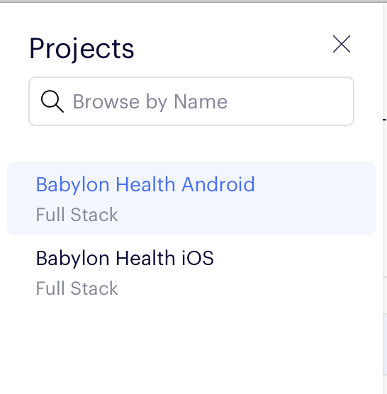

Working with Optimizely
=======================

[Optimizely](https://www.optimizely.com) is a tool for full stack software experimentation. Its two main concepts are Experiments and Features. In an experiment users are divided into two or more segments, each segment is shown a different version of the user interface and we try to collect some performance data to decide which version works best. A feature is a flag which decides whether something is available for a specific user.

## Interacting with the Optimizely Portal
Optimizely is not available in our single sign on portal. To create an account you need an administrator to send an invite to your Babylon email. Once you have registered you can [sign in here](https://app.optimizely.com/signin)

After you have signed in, select "Babylon Health iOS" under the project heading in the left hand menu.



As a front end developer you are most likely to be interested in the content under "Experiments" and "Features".

## Setting up Optimizely Experiments
Typically you will only need to worry about the variations. Other parts of an Optimizely experiment mainly concern analytics and product management. What we definitely need for implementing an experiment in the iOS app is the activation keys which you find on the variations page.


To fetch the variation that the user has been assigned to you need to define an entity which conforms to `OptimizelyExperiment` protocol and can create an instance of itself from the experiment name, variation key and the Optimizely client.

```swift
enum AwesomeExperiment: OptimizelyExperiment {
    case variationOneActivated
    case variationTwoActivated
    case failed

    static func make(experimentKey: String, variationKey: String, client: OptimizelyClientProtocol) -> AwesomeExperiment {
        switch variationKey {
          case "one":
            return .variationOneActivated
          case "two"
            return .variationTwoActivated
          default:
            return .failed
        }
    }
}
```

Note that experiments can have any number of variations, but more than two will be unusual as it gets more difficult to collect conclusive data. Presuming that Optimizely is installed as the ab testing service we can now get the variation like this

```swift
let variant = ABTestVariant<AwesomeExperiment>.makeOptimizelyVariant(
    defaultValue: AwesomeExperiment.failed
)

let variation = Current.abTestingService.value(for: variant)
```

The above code snippet presumes that we are in a builder and can access `Current` directly.

## Working with Optimizely Features
An `ABTestVariant<Bool>` that is posted to the Optimizely AB testing service will be forwarded to `isFeatureEnabled`. We typically define a `ABTestVarian<Bool>` instances as static variables

```swift
let useNewHomeScreen = Current.abTestingService.value(variant: ABTestVariant: showNewHomeScreen)
```

Querying Optimizely to see whether a feature is available currently (November 2019) yields false both when the feature is disabled and when an error occurs. This is inconsistent with their documentation so there is some hope that this will be changed in a future version of the SDK.

With Optimizely it is also possible to define feature variables. To fetch the value of a feature variable it is necessary to pass both the feature key and variable key to the Optimizely SDK. This requirement does not fit nicely with how our `ABTestingVariant` is defined. Another discrepancy with what `ABTestingVariant` expects is that there is no need to parse the returned value, this is done by the SDK.

Four datatypes, `OptimizelyBoolVariable`, `OptimizelyIntVariable`, `OptimizelyDoubleVariable` and `OptimizelyStringVariable` have been defined to work around this problem. To fetch a feature variable you need to do something like this.

```swift
let featureKey = "use_prescriptions_hub_screeen"
let maxNumberOfCardsKey = "max_number_of_cards"
let defaultMaxNumberOfCards = 4
let defaultVariable = OptimizelyIntVariable(name: maxNumberOfCardsKey, value: defaultMaxNumberOfCards)
let variant = ABTestVariant(key: featureName, defaultValue: defaultVariable, value: { _ in defaultVariable } )

let intVariable = Current.abTestingService.value(for: variant)
```

Fetching a feature variable will return `defaultValue` if there is an error.

## Detecting Updates
We are bundling a downloaded Optimizely data file which should contain values for everything that does not require network access. Optimizely will at boot time and periodically thereafter attempt to download a new version if there are any updates. By subscribing to the `dataUpdated` signal you will be notified if the data file has been updated.

```swift
public protocol ABTestingServiceProtocol {
    func tearDown()
    func value<T>(for: ABTestVariant<T>) -> T
    var dataUpdated: Signal<Void, NoError> { get }
}
```

The latest value will always be returned for a feature flag. Experiments should never return a changed activation.

When and how to react to an updated feature flag depends on the situation. It is clearly not a good experience if the user interface is updated half-way through a flow but it might be okay to update the content of a tab once the user has navigated to another tab.

## Posting Meta Data to Optimizely
Optimizely allows us to post meta data that can be used to calculate what activation to assign, whether a feature is enabled or what feature value to return. At the moment this can be done by creating a `ABTestVariant` with attributes passed in a `[String: Any]` dictionary. It might very well be that we want to have a more type safe API, but during the initial integration of Optimizely (October 2019) it was not clear how an improved API should look.

The bundle identifier, short version string, major version number, minor version number and patch version number are always added to the meta data attributes that posted to Optimizely when querying a feature or feature variable.

## Improving the Internal API
Optimizely behaves in a way that we did not expect from a remote feature flag service when we modelled our `ABTestingService` internal API. Consequently it is rather awkward to interact with Optimizely through our internal feature flag facade. Our internal API is also not making any difference between an AB test and a feature flag. During the initial integration we decided to not refactor the AB testing facade. The reason for this is that there is an accepted proposal for tidying up the AB testing facade and stop treating AB tests and feature flags on an equal footing. It is expected that we can make the Optimizely integration to be more intuitive and convenient as part of that refactoring.
