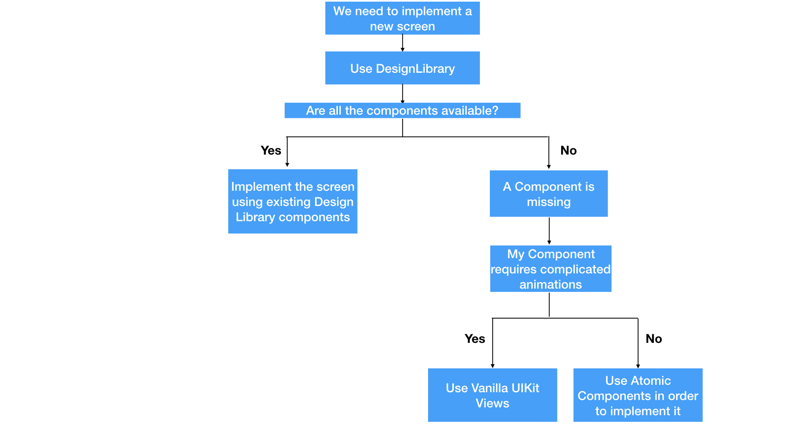
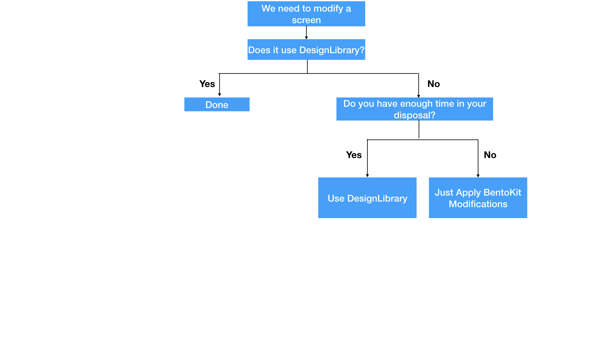
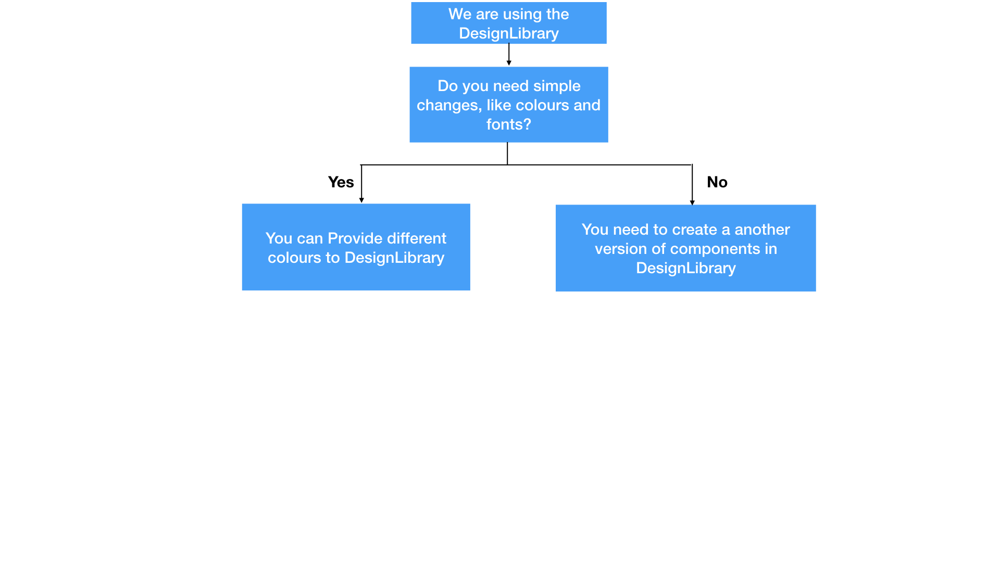

# UI Engineering Guidelines

#### Updated at: 3-04-2019

## The purpose of this document
The purpose of this document is to describe how we implement our UI in babylon and which technologies we should use.

## Nomenclature

### BentoKit

`BentoKit` is the first implementation of `Bento` Components in Babylon.
Its purpose is to provide __convenient__ components in order to assist developers.
`BentoKit` isn't suitable for Component composition. 

### Atomic Components
`Atomic Components` are the newest implementation of `Bento` Components in Babylon.
`Atomic Components` are lightweight components, they are the `Bento` equivalent of standard UIKit components. Also they can be used in `UIStackView`-based Component Composition.
[TODO Add link from this PR](https://github.com/Babylonpartners/ios-playbook/pull/72)

### DesignLibrary

`DesignLibrary` is our abstraction layer.
Instead of depending on implementations like `BentoKit` or `Atomic Components` we depend on abstractions.
For more informations please check the [proposal](./Proposals/BabylonDesignLibrary.md)

## Frequent Scenarios and how we should deal with them

#### Our Squad will need to implement a new screen, how should I deal with it?

#### Our Squad needs to modify some sections of a screen

#### My Squad needs to have a different theme in our internal application
.
